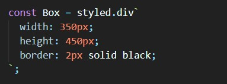

# 실습 전체 실행 화면

 

   

# 설계방법 / 코드설명

## App.js

- InputSample(실습 1번), Problem(실습 2번), Calculator(실습 3번) 컴포넌트를 차례로 화면에 나타냄
    

## 실습 1번

### Input / index.js

- name(이름 변수), nickName(닉네임 변수)에 대한 useState를 선언
- onChangeName : 이름 값이 변경되었을 때 해당 값으로 name 값 변경
- onChangeNickName : 닉네임 값이 변경되었을 때 해당 값으로 nickName 값 변경
- onReset : 초기화 버튼을 눌렀을 때 name, nickName 값 초기화
    

[InputWrapper]

- InputWrapper 박스 안에 input 2개를 생성하여 name과 nickName 값을 입력하도록 함
- InputWrapper 박스 안에 초기화 버튼을 생성하여 버튼 클릭 시 이름과 닉네임 값이 초기화 되도록 함

[ViewWrapper]

- 입력한 이름과 닉네임 값을 출력하는 부분
- 삼항 연산자를 사용하여 초기값을 설정해주고 name과 nickName에 값이 들어온 경우에는 해당 값으로 나타냄
    

## 실습 2번

### Problem / index.js

- count 변수 : 1씩 더해갈 변수
- isClick 변수 : true, false 변화를 줄 변수
- useEffect : isClick의 값이 변할 때마다 setCount를 통해 count 변수의 값에 1을 더함
- ProblemWrapper 컴포넌트 안에 count 변수의 값을 나타내고 isClick 값이 참, 거짓이 반복되도록 하는 버튼을 배치함

  

## 실습 3번

### Calulator 구성

  

### 코드설명 (calculator / index.js)

- result : 계산 결과
- num : 들어온 숫자를 문자열로 더하는 변수
- numArr : 계산할 숫자를 차례로 저장할 배열
- operArr : 계산 기호를 차례로 저장할 배열
- text : input 박스에 표시될 변수
- reset : 계산 과정을 초기화시키기 위해서 true, false 값을 반복할 변수
- userEffect : '@' 버튼을 클릭했을 때 reset의 값이 참, 거짓을 반복하며 바뀜으로써 result, num, numArr, operArr, text 변수를 초기값으로 돌림

1. else if문

<<<<<<< HEAD
- 누른 타자판의 값이 0-9 숫자이면 num 문자열에 더함 (ex) 3->8->9->2 순으로 눌렀을 때 3892식으로 숫자가 저장됨)
- text 변수에 값도 입력한 숫자로 업데이트 시켜주어 화면에 나타나도록 함

2. else문

- '='이 아닌 기호가 들어온 경우 해당 기호를 operArr 배열에 push하고 해당 기호가 들어오기 전까지 입력되었던 숫자 문자열(num)을 정수로 변환시켜 numArr 배열에 push함
- 다음 숫자를 inputBox에 나타내주기 위해 text 변수를 초기화함
- 다음 숫자를 문자열로 저장할 num 변수도 초기화함

3. if문

- '=' 기호가 클릭된 경우 지금까지 들어온 숫자와 기호를 가지고 계산을 진행함
- '=' 기호가 입력되기 바로 직전에 입력된 숫자도 numArr 배열에 정수로 push해줌
- 처음 들어온 숫자(numArr[0]) 값을 result로 설정함
- operArr 배열에 저장되어 있는 기호와 numArr 배열에 저장되어 있는 숫자를 차례로 가져오면서 해당 기호에 맞는 연산을 실시함
- 최종적으로 result에 결과 값이 저장됨
- result 변수 값을 text 값으로 설정하여 input 컴포넌트에 계산 결과를 출력함

- Box(전체 계산기 박스) 안에 입력한 숫자와 계산 결과를 나타내 줄 Input 컴포넌트와 전체 타자판 박스 NumberBox 컴포넌트를 차례로 배치함
- NumberBox 내부에는 16개의 Number(각 타자판) 컴포넌트를 배치함
- '@' 문자를 클릭한 경우에는 reset의 값이 뒤집히도록 함수를 설정하였고 이를 제외한 나머지 숫자, 기호들에 대해서는 OnClick 함수를 실행하도록 함
    

- Calculator 구성에서도 볼 수 있듯이 전체 계산기 박스를 나타냄
    

- Calculator 구성에서도 볼 수 있듯이 계산할 숫자를 나타낼 박스를 나타냄
- margin의 양옆을 auto로 설정함으로써 박스를 중앙에 배열함
- padding-right를 10px 줌으로써 Box 컴포넌트와의 여백을 줌
- display를 flex로 설정함으로써 박스를 세로 기준 가운데 정렬을 하고 박스에 나타날 텍스트는 오른쪽 정렬함
    

- Calculator 구성에서도 볼 수 있듯이 숫자, 기호판을 포함하고 있는 박스를 나타냄
- margin을 양옆에 줌으로써 NumberBox를 가운데 위치시킴
- margin을 위쪽에도 넣어줌으로써 Input 컴포넌트와의 여백을 줌
    

- Calculator 구성에서도 볼 수 있듯이 하나의 타자판을 나타냄
- &:hover을 통해 해당 타자판에 마우스가 올라갔을 때 배경색이 변하도록 함
    

  
=======
- 실습 모든 문제를 포함합니다.
- 실습의 각 문제마다 스크린샷을 포함합니다.
- pr 의 제목은 | [내이름] 제목 |으로 합니다.
  ex) [이성인] 리엑트는 너무 재밋어!

 

# 실습 제출!!

 

>>>>>>> b51621c2a823672efc293ce5c8c0f14c1f69ff66
